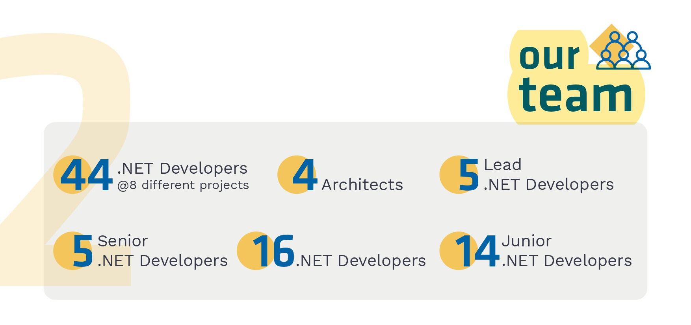
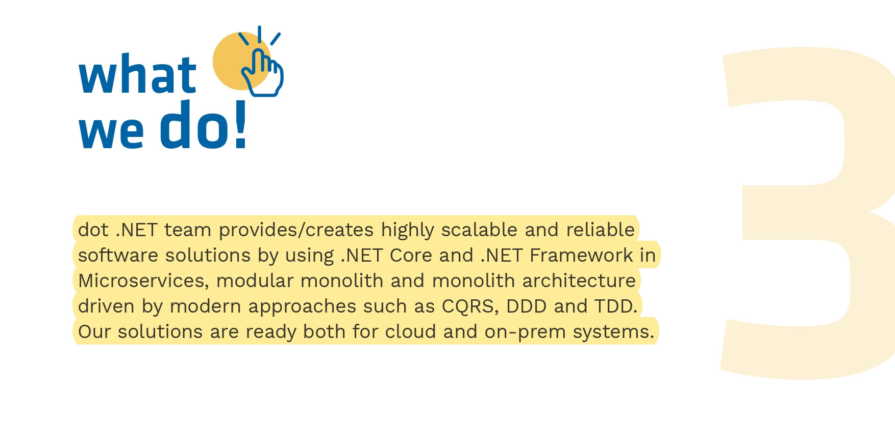
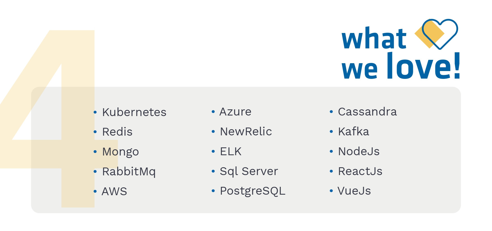
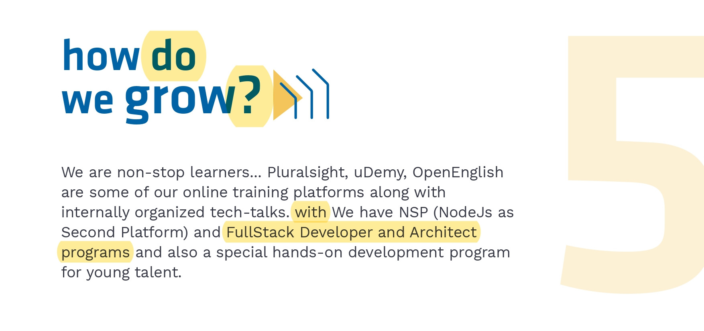

  
  <h1>adesso Turkey - .NET Team</h1>

adesso Group, with offices in Germany, Austria, Switzerland, Netherlands, Spain, Finland, Bulgaria, Turkey, U.S.A. and UK, provides IT consultancy and custom software development services focusing on core business processes of enterprises. 
 
Established in 2013, adesso Turkey is a fully-owned subsidiary of adesso Group. With more than 550 employees, it delivers custom IT solutions and IT consultancy for both Turkey and European markets. adesso Turkey is unique among adesso Group companies with its nearshore capability branded as SmartShore. 

   
   
   
  

